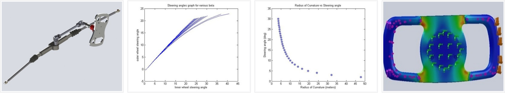
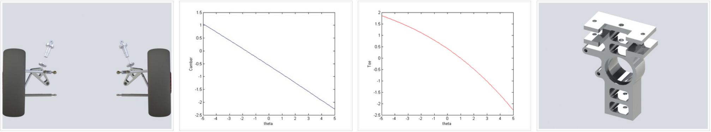
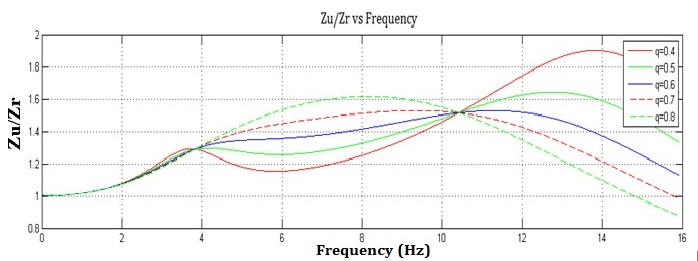
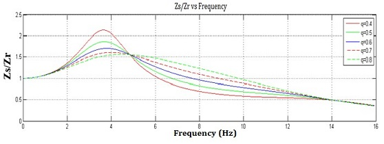

I led IIT Guwahati's student team to [Formula Bharat 2017](https://www.formulabharat.com/), a  national level competition aimed at designing and fabricating a formula styled race car. Apart from the management of the project, I was responsible for designing it's steering and suspension system with the target of maximum performance at high speed.

## Steering System
Developing the steering system of a race car requires working at the limits of handling. Designed for producing maximum cornering performance, the steering should be able to provide the necessary 'steering feel' to the driver. It is necessary for the driver to understand what is happening at the contact patch, to sense the approaching cornering limits of the tires. Fast steering response is also a necessity with a high enough self returning moment. Therefore it was necessary to get a deep understanding of the tire forces, vehicle model, suspension geometry and steering mechanism for producing an optimum system. 

Considering the endurance and autocross race track, an Ackermann type steering geometry was considered for implementation. Using available tire data, I developed a two track vehicle model with roll dynamics. Using appropriate constraints, the steering angles required by the left and right side tires are calculated. This is followed by iteratively finding out the optimum geometric parameters necessary for obtaining the required steering angles. Further, the dynamic analysis was carried out to find out the combination of scrub radius, mechanical trail and wheel radius which could provide the necessary steering feel. A final steering assembly with a 75% static ackermann will be installed in the car. 

## Suspension System
I developed pushrod double-wishbone suspension system for the rear of the car.  The main focus was obtaining the required ride quality while reducing the shimmy and shaking of rear tires, keeping the weight of the sub assembly low at the same time.

Following an iterative design approach, various design parameters of the knuckle and other components were fixed. A static analysis helped in finding out the required spring coefficient, while a quarter car model of the vehicle was used to carry out the ride analysis, to obtain the appropriate damping coefficient. Further, the variation of wheel alignment with suspension travel was studied to get a better understanding of the kinematics of the system. This was followed by a topology optimisation of the designed components to ensure robustness and sustainability of the subsystem  at minimum weight.

Here is the latest webiste of our Automobile Club at IIT Guwahati: [Link](https://www.iitg.ac.in/stud/gymkhana/technical/home/AutoHome.html)

